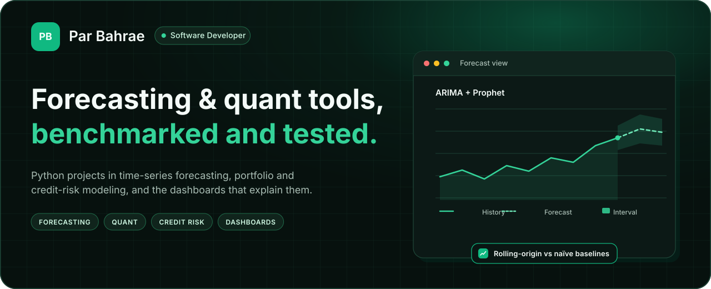

<picture>
  <source media="(prefers-color-scheme: dark)" srcset="assets/header-dark.svg">
  <source media="(prefers-color-scheme: light)" srcset="assets/header-light.svg">
  
</picture>

  
  

  Software developer building practical tools in Python, SQL, and AI. 
  Time-series forecasts, portfolio and credit-risk models, and dashboards that explain the results. 
  Forecasts and portfolio models are checked against naïve baselines or simple benchmarks. Featured repositories run in GitHub Actions.

Open to data analyst, quant, forecasting or software roles · Toronto

## About me

- 🔭 **I’m currently working on** Python projects for financial analysis: a commodity price forecaster, portfolio optimization tools, and credit-risk models. My focus is on reproducible analysis, meaningful benchmarks, and clear explanations of results.
- 🌱 **I’m currently learning** advanced time-series methods, walk-forward validation, portfolio risk management, and explainable machine learning for credit-risk assessment.
- 👯 **I’m looking to collaborate on** time-series forecasting, quantitative research, and interactive data dashboards that turn complex datasets into practical insights.
- 🤔 **I’m looking for help with** strengthening model validation, preventing data leakage, and incorporating realistic assumptions into financial backtests. I welcome thoughtful code reviews and feedback from experienced practitioners.
- 💬 **Ask me about** evaluating forecasts against naïve baselines, exploring portfolio allocation trade-offs, and building Streamlit dashboards to communicate analytical results.
- 📫 **How to reach me:** [githubproproject@proton.me](mailto:githubproproject@proton.me) or [LinkedIn](https://www.linkedin.com/in/parbahrae/).
- ⚡ **Fun fact:** I also tutor mathematics and science, and breaking down complex ideas is a skill I bring to both teaching and data analysis.

## Featured projects

<table>
  <tr>
    <td width="50%" valign="top">
      <a href="https://github.com/ParBproject/commodity-price-forecaster"> <b>Commodity Price Forecaster</b></a>  
      Energy, metals, and agriculture forecasts with ARIMA/SARIMAX and Prophet, rolling-origin validation against naïve baselines, and a Streamlit dashboard. 
      Rolling-origin, one-step checks against last-value, drift, and a 52-week seasonal-naïve baseline.  
      <code>Python</code> <code>Streamlit</code> <code>Prophet</code>
    </td>
    <td width="50%" valign="top">
      <a href="https://github.com/ParBproject/Advanced-Financial-Models"> <b>Advanced Financial Models</b></a>  
      Excel workbook plus a tested Python package for cash-flow forecasts, credit expected loss, portfolio risk, and stress tests, with a Streamlit decision dashboard. 
      Regression tests pin a credit example: $100,000 exposure × 15% PD × 45% LGD = $6,750 expected loss.  
      <code>Python</code> <code>Excel</code> <code>Streamlit</code>
    </td>
  </tr>
  <tr>
    <td width="50%" valign="top">
      <a href="https://github.com/ParBproject/stock-price-predictor"> <b>Stock Price Predictor</b></a>  
      Next-day stock forecasts with LSTM and Random Forest, leakage-safe evaluation, Backtrader backtests, and GitHub Actions CI. 
      Benchmarked against a naïve persistence baseline, with a leakage-safe evaluation.  
      <code>Python</code> <code>TensorFlow</code> <code>Backtrader</code>
    </td>
    <td width="50%" valign="top">
      <a href="https://github.com/ParBproject/Portfolio-Optimizer"> <b>Portfolio Optimizer</b></a>  
      Markowitz mean-variance optimizer in CVXPY: efficient frontier, max-Sharpe and min-variance portfolios, an equal-weight backtest, and a Streamlit UI.  
      <code>Python</code> <code>CVXPY</code> <code>Streamlit</code>
    </td>
  </tr>
  <tr>
    <td width="50%" valign="top">
      <a href="https://github.com/ParBproject/AI-Investment-Dashboard"> <b>AI Investment Dashboard</b></a>  
      Streamlit dashboard for an efficient frontier, Monte Carlo paths, Black–Scholes option pricing, and what-if scenarios.  
      <code>Python</code> <code>Plotly</code> <code>Streamlit</code>
    </td>
    <td width="50%" valign="top">
      <a href="https://github.com/ParBproject/skycast"> <b>SkyCast</b></a>  
      Installable weather and air-quality PWA on Open-Meteo: vanilla JavaScript, offline caching, and Node and Python tests. 
      22 curated European presets, a 12-hour outlook, and a seven-day forecast.  
      <a href="https://parbproject.github.io/skycast/">Live demo</a>
      &nbsp;·&nbsp;
      <code>JavaScript</code> <code>PWA</code>
    </td>
  </tr>
</table>

  
  
  

## More repositories

- **[Stroke](https://github.com/ParBproject/Stroke)** — Holdout study of the Kaggle stroke dataset: logistic regression versus tree models, calibration, and threshold choice. [Live casebook](https://parbproject.github.io/Stroke/)
- **[Generative AI Data](https://github.com/ParBproject/Generative-AI-Data)** — Browser demos for in-browser transformer sentiment, fraud exploration, a churn what-if, and data storytelling. [Live demos](https://parbproject.github.io/Generative-AI-Data/)
- **[Order fulfillment](https://github.com/ParBproject/E-commerce-Order-Fulfillment-Process-Improvement)** — Warehouse fulfillment case study on synthetic data: DuckDB SQL marts, window functions, and a before/after KPI board.
- **[Credit-risk case study](https://github.com/ParBproject/Portfolio-Risk-Analysis-Credit-Risk-Modeling)** — Written analysis of a synthetic 1,000-loan portfolio: default probability, stress tests, and a risk report.
- **[Stock screener and backtester](https://github.com/ParBproject/-Stock-Screener-Strategy-Backtester-Insider-Institutional-Signal-Tracker-)** — Streamlit equity research app for fundamental and technical screening, strategy backtests, and insider and institutional data.
- **[Algorithmic trading research](https://github.com/ParBproject/algo-trading-consultant)** — Framework to backtest, optimize, and paper-trade systematic strategies such as mean reversion, momentum, and pairs.
- **[Crypto trading research](https://github.com/ParBproject/Crypto-Trading-Bot)** — Research bot with an LSTM price model, backtests, risk controls, and paper-trading execution.

## Stack

  
  
  
  
  
   
  
  
  
  

## Contact

[githubproproject@proton.me](mailto:githubproproject@proton.me) · [LinkedIn](https://www.linkedin.com/in/parbahrae/)
